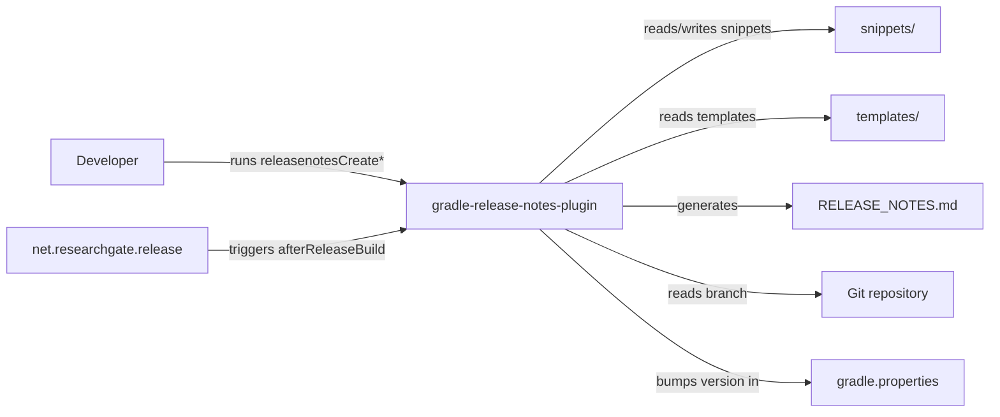
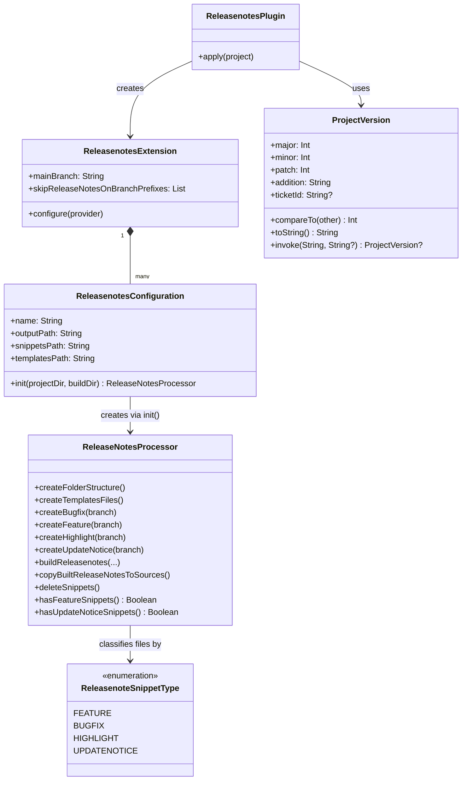
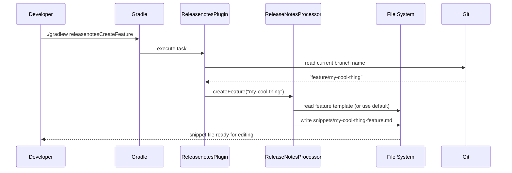
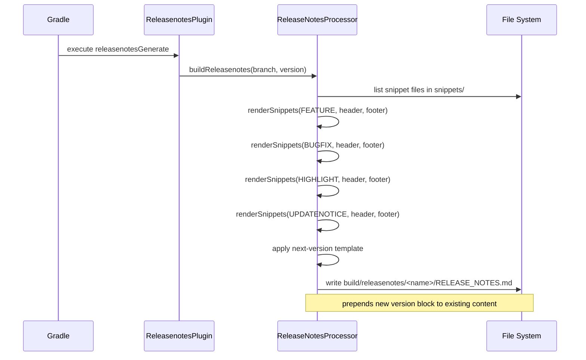
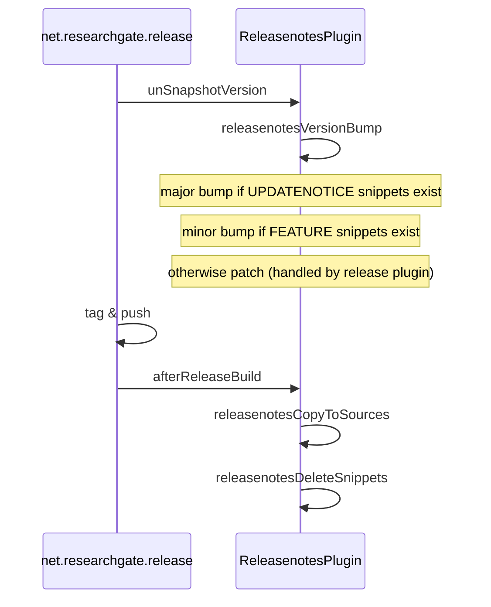

# arc42 Architecture Documentation

**gradle-release-notes-plugin** — a Gradle plugin for automated release notes management.

---

## 1. Introduction and Goals

The plugin automates the creation, aggregation, and versioning of release notes within a Gradle project. It bridges the gap between individual feature branches (each producing a snippet) and a final, formatted release notes document.

**Primary goals:**

| Goal | Description |
|------|-------------|
| Snippet-based workflow | Developers create small text snippets per branch |
| Automated aggregation | Snippets are merged into a single release notes file |
| Semantic versioning | Version bumps are derived from snippet types automatically |
| Template-driven | All output formats are fully customisable via templates |
| Multi-config support | One project can maintain multiple independent release notes documents |

---

## 2. Constraints

- Requires a **git repository** (uses [grgit](https://github.com/ajoberstar/grgit) to read the current branch)
- Project version is expected to live in `gradle.properties` as `version=X.Y.Z`
- Integrates with the [net.researchgate.release](https://github.com/researchgate/gradle-release) plugin for the release lifecycle
- Minimum Java 17 / Gradle 8+

---

## 3. Context and Scope



---

## 4. Solution Strategy

- **File-based pipeline**: snippets are plain text files classified by their filename postfix (`-feature`, `-bugfix`, `-highlight`, `-updateNotice`)
- **Template engine**: simple string replacement (`{version}`, `{date}`, `{features}`, …) — no external template engine dependency
- **Lifecycle hooks**: the plugin wires itself into existing Gradle tasks (`assemble`, `clean`, `unSnapshotVersion`, `afterReleaseBuild`) when they are present

---

## 5. Building Blocks

### 5.1 Top-level decomposition



---

## 6. Runtime View

### 6.1 Snippet creation (developer workflow)



### 6.2 Release notes generation



### 6.3 Release lifecycle integration



---

## 7. Deployment View

The plugin is published to **GitHub Packages** (Maven registry) and consumed like any other Gradle plugin:

```kotlin
// settings.gradle.kts
pluginManagement {
    repositories {
        maven {
            url = uri("https://maven.pkg.github.com/christiangroth/gradle-release-notes-plugin")
        }
    }
}

// build.gradle.kts
plugins {
    id("de.chrgroth.gradle.release-notes") version "1.0.1"
}
```

---

## 8. Cross-cutting Concepts

### Version parsing

The plugin parses semantic versions using a regex (`([0-9]+)(?:.([0-9]+))?(?:.([0-9]+))?([0-9.a-zA-Z-+_]*)`).  
The `addition` field captures suffixes like `-SNAPSHOT` or `-RC1`.

### Snippet type detection

Files in the snippets folder are classified by their filename postfix:

| Postfix | Type | Version impact |
|---------|------|----------------|
| `-feature` | `FEATURE` | minor bump |
| `-bugfix` | `BUGFIX` | patch (no bump) |
| `-highlight` | `HIGHLIGHT` | patch (no bump) |
| `-updateNotice` | `UPDATENOTICE` | major bump |

### Template variables

| Variable | Replaced with |
|----------|---------------|
| `{version}` | Project version string |
| `{date}` | Current date (configurable format) |
| `{features}` | Rendered feature snippets |
| `{bugfixes}` | Rendered bugfix snippets |
| `{highlights}` | Rendered highlight snippets |
| `{updateNotices}` | Rendered update notice snippets |
| `{gitbranch}` | Last segment of the current branch name |

---

## 9. Architecture Decisions

| Decision | Rationale |
|----------|-----------|
| Plain-text snippets | No tooling required; works with any diff tool and code review |
| File-based classification | Avoids a database or metadata; snippets are self-describing |
| Build-dir staging | Generated output is never committed until explicitly copied back |
| No external template engine | Keeps dependencies minimal; simple `String.replace` is sufficient |
| Version stored in `gradle.properties` | Follows Gradle conventions; compatible with the release plugin |

---

## 10. Quality Requirements

| Quality | Measure |
|---------|---------|
| Correctness | Unit tests for `ProjectVersion` and `ReleaseNotesProcessor` |
| Static analysis | Detekt with `warningsAsErrors = true` |
| Code coverage | Kover enforces ≥ 40 % line coverage |
| Maintainability | Kotlin idioms; explicit null handling; named constants |
